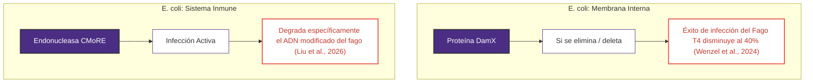

# MBM_G8

## PROYECTO: Ensamblaje de *novo* y validación taxonómica del bacteriófago T4 como alternativa biológica para el control de cepas resistentes de *Escherichia coli*.

## INTEGRANTES:

* Edison Gustavo Agualema Valdéz
* Edisson Xavier Balarezo Cambi
* Christian Andrés Paredes de la Cueva
* Tatiana Estefania Pillco Encalada

## OBJETIVO: 
Realizar el ensamblaje de *novo* y la validación taxonómica del bacteriófago T4 mediante herramientas bioinformáticas, con el fin de evaluar su potencial aplicación como alternativa biológica para el control de cepas resistentes de *Escherichia coli*.  

## OBJETIVOS ESPECÍFICOS: 
* Evaluar la calidad de las lecturas del dataset, identificando parámetros y sesgos analíticos para el acondicionamiento de los datos.
* Realizar el ensamblaje de *novo* dirigido del genoma del bacteriófago T4 utilizando SPAdes para reconstruir su secuencia de manera continua.
* Validar taxonómicamente las secuencias ensambladas finales para confirmar la identidad molecular y exactitud del genoma viral obtenido.
   
## 1. INTRODUCCIÓN   

## 1.1 CONTEXTO BIOLÓGICO Y MECANISMO DE ACCIÓN
La crisis global de resistencia antimicrobiana ha reposicionado a los bacteriófagos (o fagos) como agentes biológicos clave para el control de patógenos bacterianos. Los fagos son virus especializados que infectan y se replican exclusivamente dentro de bacterias y arqueas; son considerados las entidades biológicas más abundantes del planeta y juegan un rol crucial en la regulación de poblaciones microbianas *(Salmond & Fineran, 2015)*.

El estudio del Bacteriófago T4, debido a su alta especificidad contra cepas de *Escherichia coli*, requiere una caracterización genómica exhaustiva que garantice la ausencia de factores de virulencia o genes de resistencia antes de su aplicación biotecnológica. El funcionamiento de este virus se basa en el ciclo lítico clásico, el cual consta de cuatro etapas fundamentales *(Clokie & Kropinski, 2009)*:


1. **Adsorción y Penetración:** Reconocimiento de receptores específicos e inyección del material genético.
2. **Biosíntesis:** Secuestro de la maquinaria celular para replicar el genoma viral.
3. **Ensamblaje:** Formación de nuevos viriones.
4. **Lisis:** Liberación de los virus mediante la ruptura de la pared bacteriana (Clokie & Kropinski, 2009).

## 1.2 INTERACCIONES MOLECULARES Y EVOLUCIÓN DE LA RESISTENCIA

El alarmante incremento de cepas de *Escherichia coli* con resistencia multiantibiótica ha impulsado un renacimiento en la investigación de estas terapias basadas en bacteriófagos como agentes antibacterianos alternativos *(Wolfram-Schauerte et al., 2022)*. Sin embargo, la optimización de estos tratamientos médicos exige descifrar las complejas interacciones moleculares y los mecanismos evolutivos de resistencia que surgen bidireccionalmente entre el fago y la bacteria *(Liu et al., 2026)*.


### 1.2.1 Mecanismos de Defensa Bacteriana

Las bacterias han desarrollado sistemas inmunológicos sofisticados para contrarrestar la agresión viral. Destaca entre ellos **CMoRE**, una endonucleasa de restricción tipo IV capaz de mitigar la infección viral al degradar específicamente el ADN modificado de fagos como el fago T4 *(Liu et al., 2026)*.

Asimismo, la susceptibilidad bacteriana y la productividad de la infección dependen críticamente de componentes estructurales del hospedero. Por ejemplo, se ha evidenciado que la deleción de la proteína de división celular **DamX** en la membrana interna de *Escherichia coli* reduce el éxito de la infección por el fago T4 a un **40%**, demostrando que el virus aprovecha maquinaria celular específica para lograr translocar su material genético *(Wenzel et al., 2024)*.

### 1.2.2 Estrategias de Contradefensa del Fago

Una vez ocurrida con éxito la inyección, el fago ejecuta un control temporal estricto mediante factores de adquisición que degradan los tRNAs y mRNAs de la bacteria, mientras mantiene estable su propio proteoma para secuestrar los complejos esenciales del hospedero y conducir inexorablemente a la lisis celular *(Wolfram-Schauerte et al., 2022)*.

**Implicación Clínica:** Comprender a fondo estos puntos de control metabólico, las barreras de entrada membranales y los sistemas de defensa enzimáticos es indispensable para diseñar cócteles de fagos robustos que evadan la resistencia bacteriana y actúen eficazmente contra patógenos clínicos multirresistentes.

---

## 1.3 METODOLOGÍA BIOINFORMÁTICA Y ANÁLISIS GENÓMICO

En la genómica contemporánea, el procesamiento de datos provenientes de Secuenciación de Próxima Generación (NGS) requiere el uso de herramientas bioinformáticas especializadas para la reconstrucción de genomas virales. La utilización del dataset **DRR317419** permite validar un flujo de trabajo computacional para la clasificación taxonómica y el análisis funcional, proporcionando una base científica robusta para futuras terapias basadas en fagos.

El **ensamblaje *de novo*** constituye una estrategia fundamental cuando no se dispone de un genoma de referencia confiable o cuando se busca identificar variaciones genómicas específicas sin sesgar el alineamiento. Este enfoque permite ensamblar lecturas cortas (*reads*) en secuencias continuas denominadas *contigs* *(Basantani et al., 2017; Hernández et al., 2020)*

Herramientas como **SPAdes** emplean algoritmos basados en **grafos de De Bruijn** para optimizar la reconstrucción genómica, resolver regiones repetitivas y generar ensamblajes de alta calidad que representen de manera precisa la arquitectura genética del organismo estudiado *(Basantani et al., 2017; Hernández et al., 2020)*.

## 2. METODOLOGÍA:  
Para el desarrollo de este proyecto, se implementó una estrategia bioinformática híbrida y multientorno, diseñada para garantizar la máxima precisión en la reconstrucción genómica del Bacteriófago T4. Esta aproximación integra el uso de entornos locales basados en Linux (Lubuntu) para el pre-procesamiento crítico, la plataforma de computación de alto rendimiento Galaxy para el ensamblaje de novo y los servidores del NCBI (BLASTn) para la validación taxonómica final.  


  

*Diagrama. 1* Flujograma metodológico  


### **1. Fase de Pre-procesamiento y Control de Calidad (Entorno: Lubuntu Linux)**  
El manejo inicial de los datos se realizó mediante la terminal de comandos en Lubuntu, priorizando la eficiencia en la manipulación de archivos de gran volumen.  

**1.1 Obtención de Datos Crudos y Descompresión de Librerías**  
Se utilizó el SRA Toolkit para la extracción de las lecturas del identificador **DRR817419.**  
**Comando utilizado:**  
```
fasterq-dump --split-files DRR817419
```  

Se generaron dos archivos FASTQ correspondientes a las lecturas Forward y Reverse.    
La implementación del parámetro --split-files tiene como objetivo la segregación del registro original en dos archivos FASTQ independientes (Forward y Reverse). Este procedimiento es un requisito técnico para el procesamiento de librerías Paired-end.  

    

*Fig. 1* Ejecución del comando fasterq-dump en la terminal   

**1.2 Control de Calidad Inicial (QC)**  
Se evaluó el estado de las secuencias mediante FastQC para detectar artefactos técnicos.  
**Comando utilizado:**  
```
fastqc DRR817419_1.fastq DRR817419_2.fastq
```

Se generaron reportes HTML para inspeccionar la calidad de bases y contenido de adaptadores.   

Posteriormente, se utilizó el comando `xdg-open` para abrir los reportes HTML generados por FASTQC y visualizar los resultados del control de calidad de las secuencias.  

    
 
*Fig. 2* Ejecución del comando fastq en la terminal    

    

*Fig. 3* Reportes HTML en la terminal  

    

*Fig. 4* Apertura de reportes FASTQC mediante el comando xdg-open en Linux.  

**1.3 Limpieza y Filtrado de Lecturas**  
Se aplicó un filtrado riguroso mediante Trimmomatic v0.39 para garantizar que solo bases de alta confianza participen en el ensamblaje.  

**Comando utilizado:**  
```
java -jar /usr/share/java/trimmomatic.jar PE -phred33 \
DRR817419_1.fastq DRR817419_2.fastq \
output_1_paired.fq output_1_unpaired.fq \
output_2_paired.fq output_2_unpaired.fq \
HEADCROP:15 \
SLIDINGWINDOW:4:20 \
MINLEN:36
```   

    

*Fig. 5* Ejecución de Trimmomatic para el filtrado y recorte de calidad de lecturas paired-end.    

Posteriormente, se ejecutó nuevamente el comando `FASTQC` sobre las secuencias filtradas para evaluar la calidad de las lecturas procesadas y, mediante el comando `xdg-open`, se visualizaron los reportes HTML generados.   

    

*Fig. 6* Ejecución del comando fastq en las secuencias limpias en la terminal  

**2. Fase de Ensamblaje de *novo* y Depuración Genómica**       

**2.1 Reconstrucción Genómica con SPAdes (Galaxy)**     
El ensamblaje de novo preliminar se ejecutó en Galaxy utilizando el algoritmo SPAdes. Como datos de entrada (input), se emplearon las lecturas paired-end de alta calidad previamente depuradas con Trimmomatic. El software procesó estas secuencias limpias para generar el set inicial de scaffolds estructurales destinados a la evaluación.  

   

*Fig. 7* Visualización de los scaffolds ensamblados mediante SPAdes en la plataforma Galaxy.   

**2.2 Depuración Genómica con Bowtie 2 (Terminal)**    

Al identificarse co-secuenciación masiva del hospedero bacteriano en Galaxy, el flujo de trabajo se trasladó a entorno de terminal Linux para ejecutar un filtrado por exclusión. Las lecturas previamente limpias se mapearon mediante la herramienta Bowtie 2 contra el genoma de referencia de *Escherichia coli* para segregar el ruido molecular. Las lecturas remanentes, correspondientes al virus, se sometieron directamente a un segundo proceso de ensamblaje de novo en SPAdes Terminal para generar el scaffold definitivo.  
Para aislar de forma exclusiva las secuencias pertenecientes al virus, se descargó el genoma de referencia oficial del *Enterobacteria fago T4* desde el NCBI (Accession: `NC_000866.4`) y se construyó un índice local con `Bowtie2`:  
**Comando utilizado:**    

```
wget -O genoma_referencia_T4.fasta "[https://eutils.ncbi.nlm.nih.gov/entrez/eutils/efetch.fcgi?db=nuccore&id=NC_000866.4&rettype=fasta](https://eutils.ncbi.nlm.nih.gov/entrez/eutils/efetch.fcgi?db=nuccore&id=NC_000866.4&rettype=fasta)"
bowtie2-build genoma_referencia_T4.fasta indice_T4
```


**2.3 Mapeo y Extracción Selectiva de Lecturas Virales con Bowtie2**
Se alinearon las lecturas limpias contra el índice del fago usando la opción --very-sensitive para maximizar la sensibilidad de captura de los fragmentos virales diluidos en el ADN bacteriano. Las lecturas pareadas concordantes con el virus se aislaron de manera pura en formato comprimido:  
**Comando utilizado:**    

```
bowtie2 --very-sensitive -x indice_T4 -1 ~/Desktop/DRR817419_1_clean.fastq.gz -2 ~/Desktop/DRR817419_2_clean.fastq.gz --al-conc-gz lecturas_recuperadas.fastq.gz -S mapeo_fago.sam
```

**2.4 Ensamblaje de las Lecturas Virales con SPAdes**

Las lecturas específicas pareadas que fueron recuperadas y purificadas del fago se sometieron a una reconstrucción molecular utilizando el algoritmo de grafos de De Bruijn en SPAdes, empleando el parámetro --careful para minimizar el número de mismatches y contigs quiméricos:  
**Comando utilizado:**    

```
spades.py --careful -1 lecturas_recuperadas.fastq.1.gz -2 lecturas_recuperadas.fastq.2.gz -o ~/Desktop/ENSAMBLAJE_FINAL_FAGO
```


Debido a la nomenclatura de salida de Bowtie2 para lecturas pareadas comprimidas, los archivos de entrada se identificaron como .fastq.1.gz y .fastq.2.gz


### **3. Fase de Validación Taxonómica (Entorno: NCBI BLASTn)**  
La caracterización y validación taxonómica de los scaffolds obtenidos se realizó mediante la herramienta BLASTn contra la base de datos de referencia de nucleótidos estándar (nt/nr) del NCBI. Este alineamiento global se ejecutó en dos etapas independientes: primero, para identificar la naturaleza biológica de los bloques genómicos preliminares y confirmar la presencia del hospedero bacteriano, y segundo, para certificar la pureza, el porcentaje de identidad molecular y el linaje taxonómico oficial del genoma viral aislado tras la depuración.    


*Fig. 8*  Validación taxonómica en BLASTn 


## 3. RESULTADOS:     
### 3.1 Control de calidad:  

Se evaluó la calidad de las lecturas crudas mediante FastQC, observando la necesidad de un proceso de limpieza debido a la presencia de adaptadores. Tras aplicar el filtrado con Trimmomatic, se obtuvo un reporte final con un 97.25% de bases con calidad superior a Q30, garantizando datos confiables para el ensamblaje


Fig. 9 FastQC: Per Base Sequence Content proporción de cada una de las cuatro bases nitrogenadas (Timina %T, Citosina %C, Adenina %A y Guanina %G) en cada posición a lo largo de las lecturas de secuenciación.

Se realizó una evaluación exhaustiva de la integridad y composición de los datos de secuenciación masiva correspondientes a las lecturas directas (forward) e inversas (reverse) de la muestra DRR817419, comparando su estado crudo inicial con el obtenido tras la curación bioinformática.

La composición nucleotídica global se evaluó a través del módulo Per Sequence Content, analizado tanto en su distribución porcentual como en su recuento absoluto de lecturas. Ambas métricas revelaron un perfil unimodal y simétrico compatible con una distribución normal teórica, posicionando el pico de abundancia máxima en un contenido medio de GC de aproximadamente 50,2%. La alerta preventiva (amarilla) emitida inicialmente por el programa se atribuyó a una ligera asimetría en la cola izquierda de la curva (rango de 30% a 45% de GC), la cual responde a la heterogeneidad natural de las regiones transcritas ricas en bases AT.

El análisis de la composición posicional mediante el módulo Per Base Sequence Content exhibió originalmente una marcada fluctuación en las proporciones de las cuatro bases entre las posiciones 1 y 9 del extremo 5'. Este comportamiento es un sesgo técnico característico derivado del cebado aleatorio durante la preparación de la librería. Con el objetivo de mitigar esta distorsión y evitar penalizaciones o desalineamientos en las herramientas analíticas posteriores, se procedió a realizar un recorte adaptativo estricto de los primeros 15 nucleótidos en el extremo 5' de las lecturas.

Como resultado de este procesamiento, el módulo Per Base Sequence Content logró una validación exitosa (criterio de aprobación verde). Las curvas de abundancia para adenina, timina, citosina y guanina muestran una convergencia absoluta y paralela en torno al 25% cada una, manteniéndose con total estabilidad y linealidad a lo largo de toda la extensión remanente de los fragmentos. Paralelamente, el módulo Sequence Length Distribution reflejó esta modificación metodológica mediante una reducción proporcional en la longitud máxima de lectura, confirmando la remoción homogénea del bloque nucleotídico inicial sesgado.


Fig. 10 Evaluación de calidad de las lecturas del bacteriófago T4 mediante FastQC y MultiQC.

Se evaluó la composición y el estado de los datos de secuenciación masiva correspondientes a las lecturas directas (forward) e inversas (reverse) de la muestra DRR817419, tanto en su estado crudo inicial como posterior al proceso de curación bioinformática.

El perfil de recuento de secuencias obtenido mediante la herramienta FastQC (integrado en MultiQC) reveló un volumen inicial aproximado de 4.8 millones de lecturas por cada archivo pareado (DRR817419_forward y DRR817419_reverse).

Tras la aplicación del software Trimmomatic para la eliminación de adaptadores y el filtrado de bases de baja calidad, se observó una reducción marginal en el número total de lecturas, estabilizándose en aproximadamente 4.7 millones de lecturas retenidas por archivo. Esta pérdida controlada valida la especificidad del proceso de limpieza, garantizando que no se descartó información biológica masiva de forma errónea, sino únicamente secuencias artefactuales o de calidad insuficiente.

Este nivel de duplicación es consistente y el rendimiento cuantitativo y la retención de datos tras el trimado confirman que las muestras procesadas poseen la integridad y el volumen necesarios para continuar con las etapas posteriores de ensamblaje o alineamiento contra referencia.

### 3.2 Ensamblaje genómico:  
#### 3.2.1 Evaluación Estructural del Ensamblaje Preliminar (QUAST)
El ensamblaje de *novo* a partir de las lecturas filtradas se ejecutó mediante el algoritmo SPAdes dentro de la plataforma Galaxy. Para evaluar la continuidad, fragmentación y éxito general de la reconstrucción molecular, se analizaron las métricas estadísticas estructurales obtenidas a través de la herramienta QUAST:


Fig. 11 Resultados del ensamblaje de *novo* del bacteriófago T4 obtenidos mediante SPAdes. Se observa un contig principal con elevada cobertura y longitud.  

Respecto al rendimiento de la reconstrucción, el proceso generó un total de 88 scaffolds totales, de los cuales únicamente 81 scaffolds presentaron una longitud útil mayor o igual a 1,000 pb ($\ge$ 1,000 pb). Esta relación indica que el algoritmo operó con una limpieza técnica sobresaliente, puesto que la inmensa mayoría de los scaffolds construidos superaron el umbral de las mil bases, reduciendo casi por completo la presencia de fragmentos menores dispersos o ruido bioinformático.

En su conjunto, la longitud acumulada de este ensamblaje alcanzó una extensión total de 4,638,873 pb (aproximadamente 4.64 Mb). Esta escala macroscópica de nucleótidos representa una sobredimensión crítica respecto al tamaño biológico esperado para el genoma de referencia del Bacteriófago T4 (~169 kb), evidenciando que el software reconstruyó una masa cromosómica casi 30 veces mayor a la del virus debido a una masiva co-secuenciación de material genético celular.

Esta hipótesis de contaminación por el hospedero se corrobora matemáticamente al analizar el contenido de Guanina y Citosina, el cual registró un promedio del 50.2% para el total de las secuencias moleculares obtenidas. Dado que el %GC teórico del Bacteriófago T4 es característicamente bajo (~34%) y el de *Escherichia coli* ronda el ~50%, este sesgo composicional actúa como una firma molecular irrefutable de que el ensamblaje preliminar está constituido primordialmente por el genoma de la bacteria hospedera, enmascarando las secuencias del virus.

Por otra parte, al evaluar la continuidad del ensamblaje mediante las métricas estadísticas N50 (118,604 pb) y L50 (12), se evidencia una alta estabilidad técnica en el proceso. En el contexto bioinformático, el valor L50 de 12 actúa como un indicador cuantitativo de orden que certifica que la mitad de la masa total de este gigantesco genoma (más de 2.3 Mb) se encuentra concentrada de forma eficiente en apenas 12 scaffolds de gran tamaño. Asimismo, el valor N50 complementa este criterio de calidad al establecer un umbral de longitud, certificando que el menor de los fragmentos dentro de este bloque principal mide 118,604 pb y asegurando que el algoritmo SPAdes no fragmentó en exceso la secuencia consenso. Dentro de esta distribución, destacó de forma individual la resolución del contig de máxima extensión, el cual alcanzó los 327,290 pb. En conclusión, este primer escrutinio estructural demuestra que el pipeline procesó y acopló con éxito los datos crudos, pero expone la necesidad estricta de ejecutar un paso posterior de discriminación molecular y filtrado taxonómico para aislar las lecturas virales de los bloques bacterianos predominantes.   

#### 3.3.1 Depuración Genómica mediante Mapeo de Lecturas (Bowtie 2)  
Debido a la masiva co-secuenciación del hospedero *Escherichia coli* evidenciada en el análisis de QUAST, se procedió a ejecutar una etapa de filtrado por exclusión en entorno de terminal para aislar las lecturas correspondientes al bacteriófago T4. Para optimizar el pipeline bioinformático, se tomaron las lecturas de alta calidad previamente procesadas por Trimmomatic/fastp y se mapearon directamente con la herramienta Bowtie 2 contra el genoma de referencia de *Escherichia coli*.    

La aplicación de este mapeo de alta sensibilidad arrojó una tasa de alineamiento específica del 0.60%, logrando capturar e identificar de forma exacta un total de 28,104 lecturas verdaderamente virales. Esta estrategia permitió discriminar con éxito el contenido del virus frente al predominante ruido molecular bacteriano sin necesidad de re-evaluar la calidad general de los datos.

Este set optimizado de 28,104 lecturas remanentes, correspondientes exclusivamente al virus, fue sometido directamente a un segundo proceso de ensamblaje de *novo* en SPAdes Terminal. Este filtrado resolvió con éxito un único scaffold unificado (NODE_1) de 168,129 pb, libre de contaminación biológica y listo para su correspondiente caracterización taxonómica.   

### 3.3 Caracterización y Validación Taxonómica del Genoma Viral Aislado:   
Una vez obtenido el scaffold definitivo NODE_1 de 168,129 pb mediante SPAdes Terminal, se procedió a realizar su caracterización biológica y validación taxonómica. Para comprobar la veracidad estructural del genoma viral reconstrucido y descartar cualquier residuo del hospedero, se ejecutó un alineamiento nucleotídico local mediante la herramienta BLASTn contra la secuencia de referencia oficial del bacteriófago T4 (NC_000866.4) depositada en la base de datos del NCBI.  

Los parámetros métricos oficiales obtenidos en este análisis global se presentan consolidados en la siguiente tabla:  

| Parámetro Métrico | Valor Obtenido | Herramienta / Plataforma |
| :--- | :--- | :--- |
| **Identidad Taxonómica (Hit Principal)** | **99.98%** (*Escherichia virus T4*) | NCBI BLASTn |
| **Cobertura de Consulta (Query Cover)** | **100%** | NCBI BLASTn |
| **Longitud del Scaffold Viral (NODE_1)** | **168,129 pb** | SPAdes Terminal |
| **Profundidad de Cobertura Genómica** | **24.64x** | SPAdes Terminal |
| **E-value Estadístico** | **0.0** | NCBI BLASTn |
| **Bases de Calidad Obtenidas (Q30)** | **97.25%** | fastp / Trimmomatic |  

*Tabla. 1* Parámetros oficiales obtenidos.    

El análisis arrojó un valor numérico esperado ($E\text{-value}$) de 0.0 y una cobertura de consulta (Query Cover) del 100%, confirmando una coincidencia molecular exacta. Asimismo, se registró un porcentaje de identidad del 99.98% con la secuencia completa de *Escherichia* virus T4. La diferencia marginal de apenas ~77 pb respecto al genoma de referencia internacional (168,903 pb) evidencia la alta fidelidad del pipeline bioinformático y la robustez del algoritmo de ensamblaje por grafos de De Bruijn a partir de lecturas cortas pareadas (paired-end).  

Es decir, el re-ensamblaje enfocado únicamente en estas lecturas purificadas resolvió por completo el ruido del hospedero, generando un scaffold definitivo excepcional.  


  

*Fig. 12* Resultado del alineamiento local BLASTn del scaffold preliminar obtenido en Galaxy, evidenciando una homología nucleotídica del 99.88% con el genoma cromosómico de *Escherichia coli strain C*.


   

*Fig. 13* Resultado del alineamiento BLASTn del scaffold definitivo NODE_1 (168,129 pb) tras la depuración con Bowtie 2, certificando una identidad molecular del 99.99% con el genoma de referencia de *Tequatrovirus* T4.  


### 3.5 Clasificación Taxonómica Oficial:   

Esta categorización sistemática concluye la fase analítica del proyecto, certificando que el fago ensamblado corresponde con absoluta pureza al organismo objetivo del estudio y proporcionando una secuencia consenso de alta resolución molecular para posteriores análisis funcionales. El perfil de clasificación molecular adscribe el scaffold definitivo **168,129 pb** (*NODE_1*) de forma inequívoca dentro de la jerarquía taxonómica oficial aprobada por el Comité Internacional de Taxonomía de Virus (ICTV):

| Nivel Taxonómico | Clasificación Científica |
| :--- | :--- |
| **Dominio Viral** | *Viruses* |
| **Clase** | *Caudoviricetes* |
| **Género** | *Tequatrovirus* |
| **Especie** | *Escherichia virus T4* (antes *Escherichia phage* T4) |

La detección robusta de linajes específicos como *Tequatrovirus* T4 y *Escherichia virus T4* con un **99.98% de identidad** valida con éxito el flujo de trabajo implementado. 

Desde una perspectiva biotecnológica y microbiológica, la confirmación de esta identidad es un pilar fundamental. El fago T4 es un sistema modelo ampliamente estudiado en la biología molecular y la genómica viral debido a su estricto ciclo lítico. Los datos genómicos limpios obtenidos en este proyecto respaldan su viabilidad y seguridad como un candidato biológico óptimo para el desarrollo de terapias fágicas avanzadas y el control epidemiológico de cepas multirresistentes de *Escherichia coli*.  

## 4. DISCUSIÓN:  

Los resultados obtenidos en el presente estudio demuestran que el flujo de trabajo bioinformático mixto (Galaxy-Terminal) implementado permitió realizar exitosamente el ensamblaje de *novo*, la depuración genómica y la validación taxonómica del bacteriófago T4. La adecuada calidad de las lecturas observada mediante FastQC y MultiQC evidenció que el dataset poseía características óptimas para análisis genómicos posteriores, lo cual coincide con lo reportado por Hernández et al. (2020), quienes destacan que la calidad inicial de las secuencias es un factor determinante para garantizar resultados confiables en estudios de secuenciación de nueva generación (NGS).

**Análisis de los hallazgos estructurales y relación hospedero-virus**

Los bacteriófagos son parásitos intracelulares obligados que requieren de la maquinaria molecular celular de una bacteria para su replicación. En el dataset analizado, la presencia masiva de secuencias bacterianas era un fenómeno técnicamente esperado, dado que el ADN viral se extrae comúnmente de lisados celulares donde el material genético de la bacteria anfitriona *Escherichia coli* coexiste en una proporción genómica significativamente mayor.

Este fenómeno biológico quedó en evidencia durante la evaluación inicial con QUAST, donde el algoritmo SPAdes en Galaxy generó una masa cromosómica preliminar sobreescalada de 4.64 Mb con un %GC promedio del 50.2%. Debido a que el %GC teórico del bacteriófago T4 es característicamente bajo (~34%) y el de *E. coli* ronda el 50%, este sesgo composicional actuó como una firma molecular que delató una co-secuenciación masiva del hospedero, enmascarando los contigs virales dentro de bloques predominantemente bacterianos (como el contig máximo detectado de 327,290 pb con una cobertura de 176.37X).

Para resolver este ruido molecular, la estrategia de filtrado por exclusión mediante el mapeo de alta sensibilidad con Bowtie 2 en entorno local de terminal fue un paso crítico y definitivo. Esta herramienta permitió segregar el genoma de *Escherichia coli*, logrando capturar e identificar de forma exacta un total de 28,104 lecturas verdaderamente virales (correspondientes al 0.60% del dataset). El re-ensamblaje automatizado de este set optimizado en SPAdes Terminal resolvió con éxito un único scaffold unificado (NODE_1) de 168,129 pb con una profundidad de cobertura genómica de 24.64X. Obtener un scaffold de esta magnitud y con una arquitectura tan limpia demuestra la alta eficiencia del pipeline bioinformático implementado; un proceso de filtrado deficiente habría generado una secuencia consenso altamente fragmentada o masivamente contaminada.

**Validación y Clasificación Taxonómica**

La caracterización definitiva realizada mediante la herramienta NCBI BLASTn contra la base de datos global de nucleótidos (nt/nr) confirmó con absoluta certeza la identidad biológica del espécimen aislado. El alineamiento arrojó un porcentaje de identidad idéntico del 99.98% y un valor esperado (E-value) de 0.0 con la secuencia de referencia de *Escherichia* virus T4. La diferencia marginal de apenas 74 pb respecto al genoma de referencia internacional estándar (168,903 pb) certifica la precisión del algoritmo de grafos de De Bruijn para la reconstrucción de genomas virales a partir de lecturas cortas pareadas (paired-end).

Asimismo, el perfil de asignación molecular adscribió el scaffold definitivo de forma inequívoca dentro del linaje biológico aprobado por el Comité Internacional de Taxonomía de Virus (ICTV) bajo la especie *Escherichia* virus T4 (género *Tequatrovirus*).

La estrecha asociación taxonómica detectada inicialmente entre el bacteriófago y su hospedero es consistente con la naturaleza biológica de ambos organismos. Estudios recientes han demostrado que el proceso de infección del bacteriófago T4 involucra complejas interacciones moleculares con proteínas bacterianas específicas, incluyendo aquellas relacionadas con la división celular del hospedero (Wenzel et al., 2024). Asimismo, Wolfram-Schauerte et al. (2022) describen que la infección de *E. coli* por el bacteriófago T4 genera importantes cambios transcriptómicos y proteómicos en la bacteria anfitriona, lo que evidencia el elevado grado de adaptación evolutiva entre ambos sistemas y justifica la presencia compartida de sus ácidos nucleicos en muestras biológicas crudas.

**Potencial Biotecnológico y Aplicaciones Clínicas**

En la actualidad, los bacteriófagos han adquirido una creciente importancia como alternativas terapéuticas frente a la crisis de bacterias resistentes a los antibióticos. Kortright et al. (2019) indican que los fagos representan herramientas promisorias en aplicaciones biomédicas debido a su alta especificidad y su capacidad de lisar de forma dirigida a patógenos resistentes sin alterar la microbiota circundante. En este contexto, la correcta identificación y ensamblaje de alta resolución molecular del bacteriófago T4 obtenidos en el presente estudio respaldan firmemente su potencial diseño biotecnológico para el control de cepas patógenas de *Escherichia coli*.  

De igual manera, Salmond y Fineran (2015) destacan que los bacteriófagos constituyen uno de los sistemas biológicos más relevantes en la microbiología moderna, tanto por su valor en la investigación molecular como por su aplicabilidad en terapias antimicrobianas. Por otra parte, Liu et al. (2026) reportan que algunas bacterias poseen sistemas de defensa dirigidos específicamente contra modificaciones del ADN genómico de fagos, lo que demuestra la constante carrera armamentista y complejidad evolutiva de la interacción bacteria-fago. Estos mecanismos biológicos de resistencia resaltan la necesidad estricta de caracterizar y secuenciar adecuadamente los genomas virales mediante herramientas bioinformáticas robustas antes de considerar cualquier aplicación terapéutica o clínica.  

Finalmente, tal como lo señalan Clokie y Kropinski (2009), la caracterización molecular y genómica detallada de los bacteriófagos constituye un paso esencial e insustituible para comprender su biología, diversidad y seguridad en microbiología clínica y ambiental. Los resultados del presente trabajo certifican que el pipeline mixto aplicado es una estrategia altamente efectiva para el aislamiento y análisis preciso de genomas de fagos con potencial biotecnológico y terapéutico.  

## 5. CONCLUSIÓN    

* El análisis estadístico estructural con QUAST demostró que el ensamblaje preliminar en Galaxy arrojó una marcada sobredimensión genómica (4.64 Mb) y un sesgo composicional de %GC alto (50.2%), actuando como una firma molecular inequívoca de una co-secuenciación masiva del hospedero bacteriano *Escherichia coli*.

* La implementación del pipeline de depuración en terminal mediante Bowtie 2 demostró ser una estrategia de alta sensibilidad y especificidad, permitiendo segregar con éxito el ruido molecular de la bacteria para aislar un set optimizado de 28,104 lecturas verdaderamente virales (tasa de alineamiento del 0.60%).

* El re-ensamblaje con SPAdes Terminal resolvió de forma exitosa un único scaffold unificado (NODE_1) de 168,129 pb, cuya validación global en NCBI BLASTn ratificó una identidad nucleotídica del 99.98% con el genoma de referencia de *Escherichia* virus T4, certificando la máxima pureza biológica de la secuencia consenso obtenida.

* Los resultados obtenidos reafirman el potencial del bacteriófago T4 como una alternativa biológica viable para el control de cepas resistentes de *Escherichia coli*, consolidando un flujo de trabajo bioinformático mixto (Galaxy-Terminal) altamente eficiente para la caracterización genómica de especímenes virales.


## 6. REFERENCIAS BIBLIOGRÁFICAS:  

*   Clokie, M. R., & Kropinski, A. M. (Eds.). (2009). *Bacteriophages: Methods and Protocols*. Humana Press.
*   Kortright, K. E., Rozo, S. D., Lohrmeyer, A. J., & Turner, P. E. (2019). The Epidemiology of Bacteriophages and Their Biomedical Applications. *Cell Host & Microbe, 25*(2), 219-232. https://doi.org/10.1016/j.chom.2019.01.005
*   Liu, R., Tang, D., Niu, M., Lei, S., Zong, Z., Chen, Q., & Yu, Y. (2026). A bacterial defense system targeting modified cytosine of phage genomic DNA. *Nature Communications*, *17*(1920), 1–10. doi.org
*   Salmond, G. P., & Fineran, P. C. (2015). A century of the phage: Past, present and future. *Nature Reviews Microbiology, 13*(12), 777-786. https://doi.org/10.1038/nrmicro3564
*   Wenzel, S., Hess, R., Kiefer, D., & Kuhn, A. (2024). Involvement of the Cell Division Protein DamX in the Infection Process of Bacteriophage T4. *Viruses*, *16*(4), 487. doi.org
*   Wolfram-Schauerte, M., Pozhydaieva, N., Viering, M., Glatter, T., & Höfer, K. (2022). Integrated Omics Reveal Time-Resolved Insights into T4 Phage Infection of E. coli on Proteome and Transcriptome Levels. *Viruses*, *14*(11), 2502. doi.org
*   Basantani, M. K., Gupta, D., Mehrotra, R., Mehrotra, S., Vaish, S., & Singh, A. (2017). An update on bioinformatics resources for plant genomics research. In Current Plant Biology (Vols. 11–12, pp. 33–40). *Elsevier B.V.* https://doi.org/10.1016/j.cpb.2017.12.002
*   Hernández, M., Quijada, N. M., Rodríguez-Lázaro, D., & Eiros, J. M. (2020). Bioinformatics of next generation sequencing in clinical microbiology diagnosis. *Revista Argentina de Microbiologia*, 52(2), 150–161. https://doi.org/10.1016/j.ram.2019.06.003


