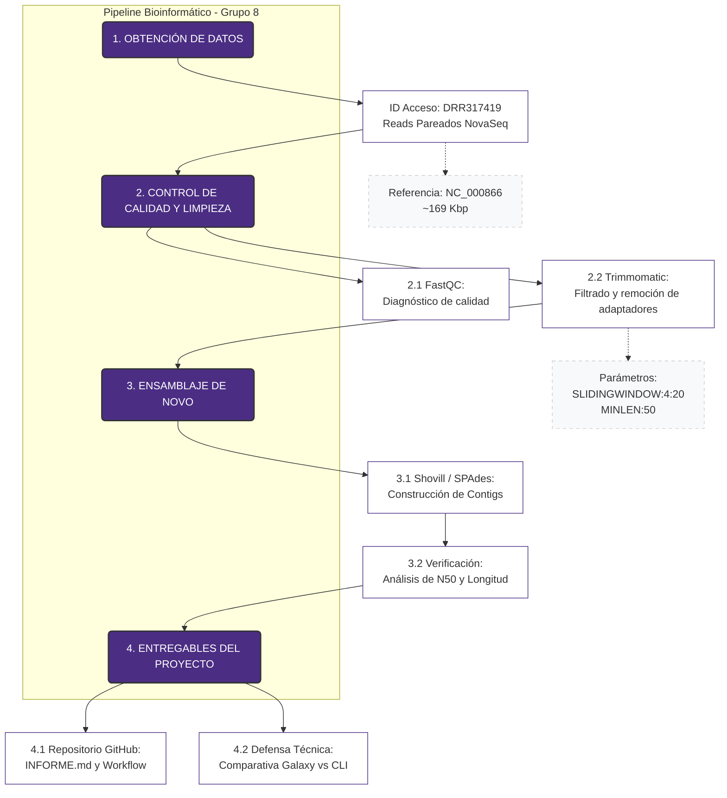

# MBM_G8
## PROYECTO: Ensamblaje de *novo* y validación taxonómica del bacteriófago T4 como alternativa biológica para el control de cepas resistentes de *Escherichia coli* 

## INTEGRANTES:
* Edison Gustavo Agualema Valdéz
* Edisson Xavier Balarezo Cambi
* Christian Andrés Paredes de la Cueva
* Tatiana Estefania Pillco Encalada
  
## OBJETIVO GENERAL:  
Realizar el ensamblaje de *novo* y la validación taxonómica del bacteriófago T4 mediante herramientas bioinformáticas, con el fin de evaluar su potencial aplicación como alternativa biológica para el control de cepas resistentes de *Escherichia coli*.

## OBJETIVOS ESPECÍFICOS:  
•	Evaluar la calidad de las lecturas del bacteriófago T4 mediante FastQC, identificando parámetros de calidad relevantes para el análisis bioinformático posterior.  
•	Realizar el ensamblaje de *novo* del genoma del bacteriófago T4 utilizando software especializado para reconstruir su secuencia genómica.   
•	Validar taxonómicamente las secuencias ensambladas mediante herramientas de comparación y clasificación molecular.   
•	Analizar la relevancia biológica del bacteriófago T4 como posible alternativa para el control de cepas resistentes de *Escherichia coli*.  

## CONJUNTO DE DATOS (DATASET):  
### Datos de Secuenciación de Lecturas Crudas (Raw Reads)
Se utilizaron lecturas crudas depositadas en el Sequence Read Archive (SRA) del NCBI, las cuales representan la base experimental para el ensamblaje de *novo* del genoma viral.  
•	**Identificador de Acceso (SRA):** DRR817419.  
•	**Plataforma de Secuenciación:** Illumina NovaSeq 6000.  
•	**Estrategia de Librería:** WGS (Whole Genome Sequencing).  
•	**Configuración de Lecturas:** Paired-end (Lecturas emparejadas).  
•	**Volumen de Datos Crudos:** 1.5 G bases, con un tamaño de archivo comprimido de 457.8 MB.  
•	**Importancia Técnica:** La utilización de la plataforma NovaSeq 6000 garantiza una alta fidelidad en las lecturas, lo que permite un pre-procesamiento riguroso y un ensamblaje de alta calidad.

### Genoma de Referencia (Gold Standard)
Con el fin de evaluar la precisión del ensamblaje generado y realizar la asignación taxonómica definitiva, se empleó la secuencia genómica de referencia oficial del NCBI.

- **Organismo:** *Escherichia virus T4* (Fago T4)
- **Número de Acceso (RefSeq):** NC_000866.4.
- **Base de datos:** NCBI Nucleotide
- **Longitud de Referencia:** 168,903 bp.
- **Topología:** ADN lineal de doble cadena (dsDNA).
- **Enlace directo:** https://www.ncbi.nlm.nih.gov/nuccore/NC_000866.4

**Aplicación:** Esta secuencia actúa como el control positivo para la validación y la identificación taxonómica mediante herramientas de alineamiento local (BLAST).

## FLUJO DE TRABAJO:  

## ## FLUJO DE TRABAJO:

## RESULTADOS:  

